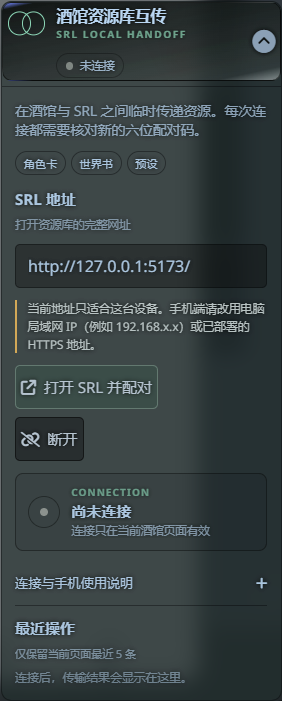

# SRL 酒馆资源库互传

这是 [SillyTavern](https://github.com/SillyTavern/SillyTavern) 与 SRL 酒馆资源库之间的双向资源桥。它是第三方扩展，不是 SillyTavern 官方组件。

页面扩展适配 SillyTavern 1.18.x；桌面端和移动端使用同一套响应式界面。



## 能做什么

- 双向传输角色卡、世界书和当前 API 类型预设。
- 双向传输快速回复组和酒馆主题。
- 区分并传输全局正则、角色卡正则、预设正则，避免写入错误作用域。
- 同名资源可选择保留副本、跳过或覆盖，覆盖前由用户确认。
- 文件使用 256 KiB 分块传输并校验 SHA-256，单文件上限 256 MB。
- 支持同一浏览器直接配对，也支持通过短时设备码连接不同浏览器、手机和未来 APK。

## 最简单的安装方法

只需要同一浏览器互传时，在 SillyTavern 中打开：

`扩展 → 安装扩展 → 输入 Git 仓库 URL`

粘贴下面的地址：

```text
https://github.com/jixiangruyi117/SillyTavern-SRL-Bridge.git
```

确认第三方扩展安全提示，等待安装完成，然后刷新 SillyTavern。以后可以在酒馆的扩展管理中检查更新。

> 直接 Git 安装只会安装页面扩展。同一浏览器使用不需要服务端插件。不要粘贴 GitHub 的网页子目录、Release ZIP 地址或 `tree/main` 地址。

如果出现“扩展程序安装失败”：

1. 先打开“扩展 → 管理扩展”，搜索 `SRL 酒馆互传`。如果已经存在，说明此前安装其实已经完成，不要重复安装，刷新酒馆即可。
2. 如果同时看到两份 SRL 扩展，保留带 Git 更新按钮的一份，删除旧的手动安装副本后刷新。
3. 仍未安装时，确认 GitHub 在当前网络可访问，并只粘贴上面的 `.git` 地址。
4. SillyTavern 服务端返回 `Directory already exists` 时，表示安装目录已存在；先在扩展管理中更新或删除旧版，不要连续点击安装。

## 手机或不同浏览器：还要安装服务端插件

页面扩展运行在浏览器中，而设备码中继必须运行在 SillyTavern 服务端。出于安全原因，页面扩展不能自行向 `SillyTavern/plugins` 写文件，所以服务端插件需要用户明确安装一次。

1. 打开 [最新版本下载页](https://github.com/jixiangruyi117/SillyTavern-SRL-Bridge/releases/latest)。
2. 下载最新版 `srl-bridge-server-plugin-v*.zip`；完全不熟悉目录的用户可以下载 `srl-bridge-complete-v*.zip`。
3. 关闭 SillyTavern。
4. 解压后把服务端的 `srl-bridge` 文件夹放到 `SillyTavern/plugins/srl-bridge`。
5. 确认最终路径是 `SillyTavern/plugins/srl-bridge/index.mjs`，不要多套一层文件夹。
6. 打开 `SillyTavern/config.yaml`，把 `enableServerPlugins` 设置为 `true`。
7. 重新启动 SillyTavern。日志出现 `[SRL Bridge] Short-lived device relay loaded` 即加载成功。

服务端插件下载直达：[打开最新 Release](https://github.com/jixiangruyi117/SillyTavern-SRL-Bridge/releases/latest)

### Windows 一键安装服务端插件

酒馆助手和其他页面扩展运行在浏览器里，没有权限写入 `SillyTavern/plugins` 或修改 `config.yaml`，因此不能安全代装服务端插件。Windows 用户可以用仓库提供的安装脚本完成下载、旧版备份、复制和启用配置。

推荐先下载并查看脚本，再在 PowerShell 中运行。脚本会自动寻找当前目录、桌面、文档、下载目录和各磁盘常见位置中的 SillyTavern；发现多个安装时会让你选择：

```powershell
powershell -ExecutionPolicy Bypass -File .\install-server-plugin.ps1
```

[下载安装脚本](https://raw.githubusercontent.com/jixiangruyi117/SillyTavern-SRL-Bridge/main/scripts/install-server-plugin.ps1)

熟悉 PowerShell、确认信任本仓库后，也可以一行安装：

```powershell
$code = Invoke-RestMethod "https://raw.githubusercontent.com/jixiangruyi117/SillyTavern-SRL-Bridge/main/scripts/install-server-plugin.ps1"; & ([scriptblock]::Create($code))
```

自动识别失败时再显式指定自己的路径：

```powershell
powershell -ExecutionPolicy Bypass -File .\install-server-plugin.ps1 -SillyTavernPath "E:\你自己的目录\SillyTavern"
```

使用 `npx sillytavern --global` 的用户还可以追加 `-ConfigPath "$env:APPDATA\SillyTavern\config.yaml"`。脚本不会启动或关闭酒馆；安装完成后必须完全重启 SillyTavern。直接执行网络脚本具有供应链风险，不信任仓库时请继续使用上面的 ZIP 手动安装。

### Android / Termux、Linux 与 macOS

Android 上只有在 Termux 内实际运行 SillyTavern 时才需要安装服务端插件；iPhone/iPad 只是访问其他设备上的酒馆，应在运行酒馆的那台电脑或服务器安装。

Termux 先安装下载与解压工具：

```bash
pkg install curl unzip -y
```

然后执行自动识别安装：

```bash
bash <(curl -fsSL https://raw.githubusercontent.com/jixiangruyi117/SillyTavern-SRL-Bridge/main/scripts/install-server-plugin.sh)
```

脚本优先识别官方 Termux 常见的 `~/SillyTavern`，也会在用户目录内查找；存在多个副本时会让用户选择。这里使用进程替换而不是 `curl | bash`，确保安装器仍能读取你的路径选择。Linux/macOS 同样可用。自动识别失败时下载脚本后运行：

```bash
bash install-server-plugin.sh --path "/你自己的路径/SillyTavern"
```

为了能够选择路径，不要给交互式安装命令追加 `--non-interactive`。不希望直接执行联网脚本时，请先下载并检查内容再运行。

## 我应该安装哪个

| 使用方式 | 页面扩展 | 服务端插件 |
| --- | --- | --- |
| SRL 与酒馆在同一个浏览器 | 必须 | 不需要 |
| 同一电脑的两个不同浏览器 | 必须 | 必须 |
| 手机连接电脑上的酒馆 | 必须 | 必须 |
| SRL 打包为 APK 后连接酒馆 | 必须 | 必须 |

## 使用方法

### 同一浏览器

1. 在酒馆的扩展设置中展开“SRL 酒馆互传”。
2. 填写 SRL 地址，点击“打开并配对”。
3. 核对双方显示的六位确认码。
4. 在 SRL 中选择资源并决定传入或拉取。

### 手机或不同浏览器

1. 确认页面扩展和服务端插件都已安装。
2. 在酒馆扩展中点击“生成跨浏览器设备码”。
3. 在另一浏览器或手机打开 SRL，进入“功能 → 酒馆互传”。
4. 填写当前酒馆地址和八位设备码，再核对六位确认码。

手机不能填写 `127.0.0.1`，因为它指向手机自己。应填写运行酒馆电脑的局域网地址，例如 `http://192.168.1.10:8000`。公网使用必须配置 HTTPS、SillyTavern 登录和访问控制，不要直接裸露酒馆端口。

## 安全设计

- 每次连接都由用户主动发起，不后台同步。
- 设备码两分钟失效，连接最长保留三十分钟，服务重启后立即清空。
- 服务端中继只保存限额内存消息队列，不把角色卡或其他资源写入服务器磁盘。
- 配对校验协议版本、精确来源、通道 ID、声明大小和 SHA-256。
- 服务端插件拥有与 SillyTavern 服务端相同的本机权限，只应从本仓库发布页下载。

## 当前限制

- 酒馆助手脚本尚未接入互传。
- 跨设备连接要求双方都能访问同一个 SillyTavern 地址。
- 服务端插件目前通过 Release 或 Windows 安装脚本更新；页面扩展可通过酒馆扩展管理更新。
- Netlify 等静态网站可以托管 SRL 和下载包，但不能代替安装在 SillyTavern 主机上的服务端插件。

## 开发与验证

```bash
npm install
npm run check
```

发布包由以下命令生成：

```powershell
powershell -ExecutionPolicy Bypass -File scripts/package-release.ps1
```

真实联调脚本为 `tests/bridge.e2e.mjs`，凭证只从运行时环境变量读取，不写入仓库。
