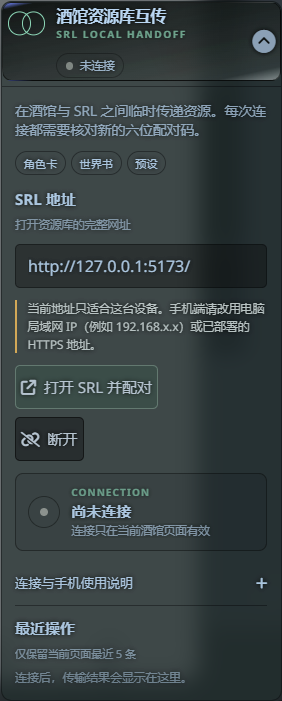

# SRL 酒馆资源库互传

> 当前页面扩展版本为 0.3.27。当 APK 与酒馆同在一台安卓设备且酒馆地址恰为 `http://127.0.0.1:8000`，APK 点击“发现并连接本机酒馆”后，用户只需在此扩展点击一次“允许本机 APK 连接”，无需设备码；文件字节不经过云端而在带随机令牌的临时本机端点传输。其余场景继续使用 HTTPS 设备码和经 SHA-256 校验的限额分块中继；本机直传失败会自动回退，不会开放任意本机地址。

这是 [SillyTavern](https://github.com/SillyTavern/SillyTavern) 与 SRL 酒馆资源库之间的双向资源桥。它是第三方扩展，不是 SillyTavern 官方组件。

页面扩展适配 SillyTavern 1.18.x；桌面端和移动端使用同一套响应式界面。



## 能做什么

- 双向传输角色卡、世界书和当前 API 类型预设。
- 双向传输快速回复组、酒馆主题、用户人设和用户头像。
- 区分并传输全局正则、角色卡正则、预设正则，避免写入错误作用域。
- 同名资源可选择保留副本、跳过或覆盖，覆盖前由用户确认。
- 文件使用 256 KiB 分块传输并校验 SHA-256，单文件上限 256 MB。
- 支持同一浏览器直接配对，也支持通过短时设备码连接不同浏览器、手机和未来 APK。
- 0.3.22 起，同机 APK 与 `http://127.0.0.1:8000` 酒馆可一键请求连接：APK 发起后由酒馆扩展明确允许一次；批准密钥只在该酒馆页面和回环服务端短暂存在，APK 无法自行批准。
- 0.3.23 起，过期的本机连接请求会自动从酒馆扩展中移除；回到 APK 重新发起后再点击允许即可。
- 0.3.25 起，已连接会话在双方仍轮询或传输时续期，连续 4 小时无活动才过期；可随时在资源库或酒馆扩展手动断开；可在真实酒馆页面中临时预览单个开场白或美化资源，不会导入或写入酒馆数据。
- 0.3.27 起，临时预览使用酒馆公开消息 API 生成完整消息 DOM，而不是手写残缺 `.mes` 节点；关闭或下一次预览都会移除临时节点，不写入聊天记录。资源库不会自动打开或跳转酒馆页面。
- 跨浏览器连接时，原 HTTPS 资源库始终保持为顶层页面并继续使用原 IndexedDB；设备码通过 SRL 的短时内存中继连接，不会打开或保留另一份资源库/中继窗口。
- 0.3.8 起同浏览器由酒馆直接打开 SRL 顶层页面，安卓不再经过 iframe 中间页；设备码加入只需要八位码，不会因不同浏览器入口或重定向误报来源不一致。
- 如果仍看到完整资源库出现在 `127.0.0.1/.../join` 页面，或仍出现“SRL 来源与设备码不一致”，说明页面扩展或服务端插件尚未更新到 0.3.8；两部分都要更新并重启 SillyTavern。
- 0.3.9 起跨浏览器文件互传使用 4 分块流水线确认，速度会比逐块等待确认更快；仍保留分块确认和 SHA-256 校验。
- 0.3.10 起流水线窗口会在 2 到 8 个分块之间按确认速度自动调整，网络好时更快，移动端变慢时自动收敛。
- 0.3.15 修复“从酒馆取回”时页面扩展等待分块确认、同时又无法处理确认消息的死锁。
- 0.3.16 起连接时会向 SRL 报告页面扩展版本；如果只更新了服务端插件，SRL 会直接提示更新页面扩展，不再等到文件传输超时。
- 0.3.18 起支持酒馆助手脚本互传：导入会保留原始结构、换新 id 并默认停用，用户需在酒馆助手中手动启用。
- 0.3.20 起支持用户人设 JSON 与用户头像互传；人设不提供“副本”冲突策略，避免人设 JSON 与头像文件名失配。

## 最简单的安装方法

只需要同一浏览器互传时，在 SillyTavern 中打开：

`扩展 → 安装扩展 → 输入 Git 仓库 URL`

粘贴下面的地址：

```text
https://github.com/jixiangruyi117/SillyTavern-SRL-Bridge.git
```

确认第三方扩展安全提示，等待安装完成，然后刷新 SillyTavern。以后可以在酒馆的扩展管理中检查更新。

> 直接 Git 安装只会安装页面扩展。同一浏览器使用不需要服务端插件。不要粘贴 GitHub 的网页子目录、Release ZIP 地址或 `tree/main` 地址。

如果出现“扩展程序安装失败”：

1. 先打开“扩展 → 管理扩展”，搜索 `SRL 酒馆互传`。如果已经存在，说明此前安装其实已经完成，不要重复安装，刷新酒馆即可。
2. 如果同时看到两份 SRL 扩展，保留带 Git 更新按钮的一份，删除旧的手动安装副本后刷新。
3. 仍未安装时，确认 GitHub 在当前网络可访问，并只粘贴上面的 `.git` 地址。
4. SillyTavern 服务端返回 `Directory already exists` 时，表示安装目录已存在；先在扩展管理中更新或删除旧版，不要连续点击安装。

## 手机或不同浏览器：推荐 HTTPS 设备码

0.3.17 起，设备码由 SRL 的 HTTPS 服务端内存中继承载。正常使用只需安装页面扩展并把扩展中的 SRL 地址填写为已部署服务端的 HTTPS 资源库；不再要求手机访问 SillyTavern 的本机 HTTP 地址，也不需要打开中继窗口。

> 服务端插件现在只是旧版 SRL、纯本机离线部署的兼容回退。需要兼容旧部署时再按下方教程安装；一键脚本仍会安全更新已经通过 Git 安装的页面扩展。

1. 打开 [最新版本下载页](https://github.com/jixiangruyi117/SillyTavern-SRL-Bridge/releases/latest)。
2. 下载最新版 `srl-bridge-server-plugin-v*.zip`；完全不熟悉目录的用户可以下载 `srl-bridge-complete-v*.zip`。
3. 关闭 SillyTavern。
4. 解压后把服务端的 `srl-bridge` 文件夹放到 `SillyTavern/plugins/srl-bridge`。
5. 确认最终路径是 `SillyTavern/plugins/srl-bridge/index.mjs`，不要多套一层文件夹。
6. 打开 `SillyTavern/config.yaml`，把 `enableServerPlugins` 设置为 `true`。
7. 重新启动 SillyTavern。日志出现 `[SRL Bridge] Short-lived device relay loaded` 即加载成功。

服务端插件下载直达：[打开最新 Release](https://github.com/jixiangruyi117/SillyTavern-SRL-Bridge/releases/latest)

### Windows 一键安装服务端插件

酒馆助手和其他页面扩展运行在浏览器里，没有权限写入 `SillyTavern/plugins` 或修改 `config.yaml`，因此不能安全代装服务端插件。Windows 用户可以用仓库提供的安装脚本完成下载、旧版备份、复制和启用配置。

推荐先下载并查看脚本，再在 PowerShell 中运行。脚本会自动寻找当前目录、桌面、文档、下载目录和各磁盘常见位置中的 SillyTavern；发现多个安装时会让你选择：

```powershell
powershell -ExecutionPolicy Bypass -File .\install-server-plugin.ps1
```

[下载安装脚本](https://raw.githubusercontent.com/jixiangruyi117/SillyTavern-SRL-Bridge/main/scripts/install-server-plugin.ps1)

熟悉 PowerShell、确认信任本仓库后，也可以一行安装：

```powershell
$code = Invoke-RestMethod "https://raw.githubusercontent.com/jixiangruyi117/SillyTavern-SRL-Bridge/main/scripts/install-server-plugin.ps1"; & ([scriptblock]::Create($code))
```

自动识别失败时再显式指定自己的路径：

```powershell
powershell -ExecutionPolicy Bypass -File .\install-server-plugin.ps1 -SillyTavernPath "E:\你自己的目录\SillyTavern"
```

使用 `npx sillytavern --global` 的用户还可以追加 `-ConfigPath "$env:APPDATA\SillyTavern\config.yaml"`。脚本不会启动或关闭酒馆；安装完成后必须完全重启 SillyTavern。直接执行网络脚本具有供应链风险，不信任仓库时请继续使用上面的 ZIP 手动安装。

### Android / Termux、Linux 与 macOS

Android 上只有在 Termux 内实际运行 SillyTavern 时才需要安装服务端插件；iPhone/iPad 只是访问其他设备上的酒馆，应在运行酒馆的那台电脑或服务器安装。

Termux 先安装下载工具：

```bash
pkg install curl -y
```

然后执行自动识别安装：

```bash
bash <(curl -fsSL https://raw.githubusercontent.com/jixiangruyi117/SillyTavern-SRL-Bridge/main/scripts/install-server-plugin.sh)
```

安装器的更新策略：先下载并校验新插件文件；确认新文件有效后才移动旧的 `plugins/srl-bridge`；新插件安装和配置写入成功后，默认删除旧插件临时备份。若中途失败，会自动把旧插件恢复回 `plugins/srl-bridge`。如果你想手动保留旧版备份，可以追加 `--keep-backup`。

脚本优先识别官方 Termux 常见的 `~/SillyTavern`，也会在用户目录内查找；存在多个副本时会让用户选择。这里使用进程替换而不是 `curl | bash`，确保安装器仍能读取你的路径选择。Linux/macOS 同样可用。自动识别失败时下载脚本后运行：

```bash
bash install-server-plugin.sh --path "/你自己的路径/SillyTavern"
```

默认模式直接下载 `index.mjs` 和 `relay.js`，不经过容易返回 403 的 GitHub Release 附件，也不需要 `unzip`；Raw GitHub 失败时会自动改用 jsDelivr 镜像。只有使用离线包 `--package 文件.zip` 时才需要先执行 `pkg install unzip`。为了能够选择路径，不要给交互式安装命令追加 `--non-interactive`。不希望直接执行联网脚本时，请先下载并检查内容再运行。

## 我应该安装哪个

| 使用方式 | 页面扩展 | 服务端插件 |
| --- | --- | --- |
| SRL 与酒馆在同一个浏览器 | 必须 | 不需要 |
| 同一电脑的两个不同浏览器 | 必须 | HTTPS 中继不需要 |
| 手机连接电脑上的酒馆 | 必须 | HTTPS 中继不需要 |
| APK 连接同一手机的 `127.0.0.1:8000` 酒馆并使用一键连接 | 0.3.22+ | 0.3.22+ |
| APK 连接其他设备上的酒馆 | 必须 | HTTPS 中继不需要 |

## 使用方法

### 同一浏览器

1. 在酒馆的扩展设置中展开“SRL 酒馆互传”。
2. 填写 SRL 地址，点击“打开并配对”。
3. 核对双方显示的六位确认码。
4. 在 SRL 中选择资源并决定传入或拉取。

### 手机或不同浏览器

1. 确认页面扩展已更新到 0.3.17 或更高版本，SRL 云服务器也已更新。
2. 在酒馆扩展中点击“生成跨浏览器设备码”。
3. 在另一浏览器或手机打开 SRL，进入“功能 → 酒馆互传”。

### 同一台 Android 手机上的本机酒馆

1. 确认酒馆地址是精确的 `http://127.0.0.1:8000`，页面扩展和服务端插件都更新到 0.3.22 或更高版本，并重启酒馆。
2. 在 APK 的“功能 → 酒馆互传”点击“发现并连接本机酒馆”。
3. 回到酒馆扩展，点击“允许本机 APK 连接”。无需输入设备码；未批准前不会建立互传。
4. 只填写八位设备码，再核对六位确认码。

资源列表始终留在原来的 HTTPS SRL 页面，不会再打开中继窗口或另一份空资源库。八位设备码是本次连接的短时通行证，加入后立即换成随机长令牌，并继续要求核对六位确认码。

## 安全设计

- 每次连接都由用户主动发起，不后台同步。
- 设备码等待两分钟失效；任一端停止连接约三十分钟后清理，双方保持在线时可持续使用；服务重启后立即清空。
- 服务端中继只保存限额内存消息队列，不把角色卡或其他资源写入服务器磁盘。
- 配对校验协议版本、精确来源、通道 ID、声明大小和 SHA-256。
- 服务端插件拥有与 SillyTavern 服务端相同的本机权限，只应从本仓库发布页下载。

## 当前限制

- 酒馆助手脚本尚未接入互传。
- HTTPS 设备码要求酒馆页和资源库页都能访问同一个已部署 `/api/bridge` 的 SRL 服务端。
- 纯 Netlify 静态站没有内存中继接口；此时只能部署配套服务端，或使用旧的本机服务端插件兼容回退。

## 开发与验证

```bash
npm install
npm run check
```

发布包由以下命令生成：

```powershell
powershell -ExecutionPolicy Bypass -File scripts/package-release.ps1
```

真实联调脚本为 `tests/bridge.e2e.mjs`，凭证只从运行时环境变量读取，不写入仓库。
